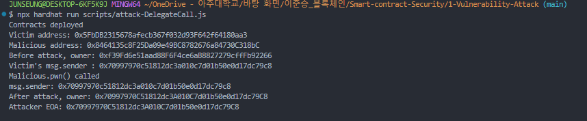

# 🧨 Delegatecall 취약점 실습 리포트

## 🧠 실습 목적

- `delegatecall`의 msg.sender 유지 특성을 이해한다.
- 외부 컨트랙트가 호출자의 storage를 조작할 수 있는 구조를 실습한다.
- storage layout 충돌, 권한 탈취 가능성을 확인한다.

## 🔁 실습 흐름

```
EOA (공격자)
   ↓ call
Victim.delegateSet(lib, payload)
   ↓ delegatecall
Malicious.pwn()
   → Victim의 storage에 접근하여 owner = msg.sender 설정
```

## 🧩 프로젝트 구조

```
/contracts/delegatecall/
├── Victim.sol             // delegatecall을 수행하는 호출자 컨트랙트
├── Malicious.sol          // 공격 로직이 담긴 외부 라이브러리 컨트랙트
├── DeployAndAttack.sol    // 중간 호출자 컨트랙트 (실패 케이스 테스트용)
├── attack.js              // EOA가 직접 공격을 수행하는 스크립트
```

## ❓ 주요 학습 질문

- delegatecall을 사용할 때 msg.sender는 어떻게 결정되는가?
- storage context는 어느 쪽을 기준으로 결정되는가?
- Victim과 Malicious의 storage 구조가 일치하지 않으면 어떤 문제가 생기는가?

## ✅ 실습 결과 요약



| 항목                        | 값                                               |
| --------------------------- | ------------------------------------------------ |
| Victim.owner 초기값         | deployer 주소                                    |
| 공격 실행 주체              | attacker EOA                                     |
| 공격 후 Victim.owner        | attacker 주소 (성공)                             |
| delegatecall 구조 활용 여부 | ✅                                               |
| storage layout 동일 여부    | ✅ (Malicious와 Victim 모두 slot 0에 owner 정의) |

## 📌 실습에서 얻은 인사이트

- delegatecall은 **코드는 외부에서, storage는 내부에서** 실행되는 특이한 구조다.
- msg.sender는 **delegatecall을 호출한 EOA**로 유지된다.
- 공격자가 임의의 코드로 Victim의 상태를 변경할 수 있으므로,
  delegatecall은 **엄격한 검증 없이 사용하면 치명적인 권한 취약점**을 유발할 수 있다.
