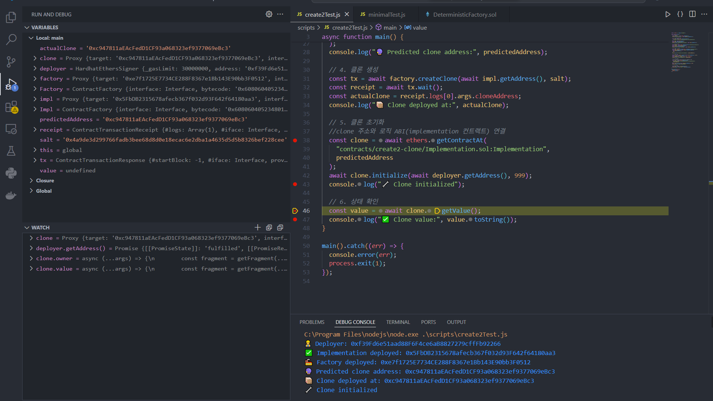
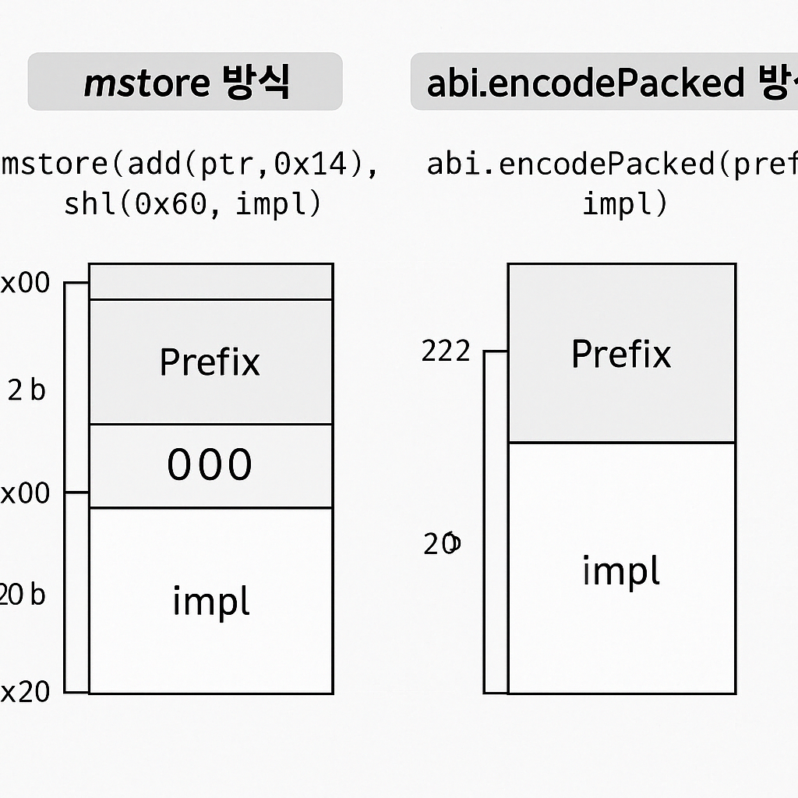

# 🐞 DEBUG LOG – CREATE2 기반 Deterministic Clone

## ⚠️ 주요 디버깅 이슈 및 해결 내역 요약

---

### 1. `getValue()` 호출 시 BAD_DATA 오류



- **원인**: clone 주소가 정상적으로 배포되지 않음 (`0x`)
- **해결**: `ethers.provider.getCode(cloneAddress)`로 바이트코드 유무 확인 → `0x`일 경우 배포 실패
- **조치**: `create2` 직후 `extcodesize` 체크 및 `require(clone != address(0))` 추가

---

### 2. `ethers.getContractAt(...)` 사용 시 ABI 연결 오류

- **원인**: minimal proxy는 바이트코드만 존재 → 자체 ABI 없음
- **해결**: 수동 ABI 연결 방식으로 대체:
  ```js
  const abi = ["function getValue() view returns (uint256)"];
  const clone = new ethers.Contract(cloneAddress, abi, signer);
  ```

---

### 3. `create2` 주소 예측 mismatch



- **원인**: `abi.encodePacked(...)` 구성과 실제 생성 시 `mstore` 방식 불일치
- **해결**: `abi.encodePacked(prefix, impl, suffix)` 방식으로 수정 → 정확한 `keccak256(bytecode)` 계산 가능

---

### 4. `Transaction reverted without a reason string`

- **원인**: clone 배포 실패 or 생성된 주소에 코드 없음
- **해결**:
  - `clone := create2(...)` 직후 `extcodesize(clone)` 체크
  - 예측 주소와 실제 배포 주소가 일치하는지 확인

---

### 5. `invalid opcode` 오류 발생

- **원인**: fallback 없는 Implementation에서 delegatecall 실행 시 revert
- **조치**: Implementation 컨트랙트에 `fallback()` 함수 추가하여 수신 처리

---

### 6. JS에서 clone과 ABI 연결 후 Promise 결과 미확인

- **조치**:
  - 디버깅 시 Promise 객체 내부 확인은 `.then()` 또는 `await` 필수
  - VScode Debug console에서 Promise 내부 `[[PromiseResult]]` 상태 반드시 확인

---

### 7. `Implementation` 중복 경로로 인한 `HH701` 오류

- **에러**: `HH701: Multiple artifacts for contract "Implementation"`
- **해결**: `getContractFactory("contracts/.../Implementation.sol:Implementation")` 형태로 정확하게 지정

---

## ✅ 디버깅 마무리 확인 사항

- [x] clone 주소 `extcodesize > 0` 확인
- [x] 예측 주소와 실제 배포 주소 일치 여부 검증
- [x] initialize → getValue 흐름 정상 작동
- [x] fallback 유무 확인
