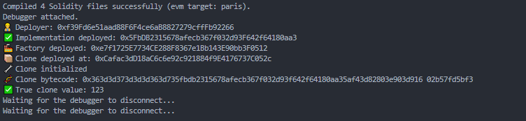

# 🧬 Minimal Proxy 실습 (EIP-1167 기반)

## ✅ 실습 목표

- EIP-1167 Minimal Proxy 구조를 직접 구현하고 이해한다.
- `delegatecall` 기반으로 로직을 위임하는 구조를 실습한다.
- 클론 컨트랙트를 생성하고, ABI가 없는 상태에서 데이터를 안전하게 호출하는 방법을 익힌다.

---

## 🔧 구성

```
2-Proxy-Pattern/
├── contracts/
│   └── minimal-proxy/
│       ├── Implementation.sol
│       └── MinimalProxyFactory.sol
├── scripts/
│   └── minimalTest.js
```

---

## 🧩 주요 개념

### 📌 EIP-1167 Minimal Proxy란?

- 바이트코드 기반으로 `delegatecall`만 수행하는 초소형 Proxy
- 배포 비용 & 저장 공간 대폭 절약
- 클론들은 동일한 로직(Implementation)을 참조

### 🧠 Bytecode 구조

| 구성요소  | 바이트수 | 설명                                   |
| --------- | -------- | -------------------------------------- |
| Prefix    | 10 bytes | delegatecall 수행을 위한 고정 오퍼코드 |
| Impl 주소 | 20 bytes | 참조할 로직 컨트랙트 주소              |
| Suffix    | 15 bytes | 반환 처리 및 종료                      |

```
총합: 0x0a + 0x14 + 0x0f = 0x37 (55 bytes)
```

---

## 🛠️ 실행 흐름

1. 로직 컨트랙트 `Implementation` 배포
2. Factory 배포 → `createClone()` 호출
3. `mstore`로 메모리에 Prefix + Impl 주소 + Suffix 기록
4. `create()`로 Minimal Proxy 배포
5. 생성된 클론 주소를 추출 (`logs[0].args.proxy`)
6. ABI 수동 지정 후 함수 호출 성공

---

## 📊 실습 결과



| 단계                       | 상태                  |
| -------------------------- | --------------------- |
| Implementation 배포        | ✅                    |
| Minimal Proxy Factory 배포 | ✅                    |
| Clone 생성                 | ✅                    |
| Clone 초기화 (initialize)  | ✅                    |
| Clone 상태 확인 (getValue) | ✅ ABI 수동 지정 필요 |

---

## 📝 실습을 통해 알게 된 점

- Proxy 패턴이더라도 Minimal Proxy는 ABI가 없어 직접 호출 불가
- `ethers.getContractAt()` 대신 `ethers.Contract()` 사용 필요
- 메모리 정렬(Padding, 32 bytes) 고려한 `mstore` 이해
- `0x28`, `0x37` 같은 위치는 단순 이동이 아니라 오프셋 + 크기 이해 필요

---

## 🧠 참고: Minimal Proxy vs 일반 Proxy 차이

| 항목      | 일반 Proxy              | Minimal Proxy                |
| --------- | ----------------------- | ---------------------------- |
| 구조      | Fallback + Storage 공유 | 바이트코드 기반 delegatecall |
| ABI 존재  | 있음                    | 없음 (직접 지정 필요)        |
| 가스 효율 | 보통                    | 매우 우수                    |
| 확장성    | Upgradeable 가능        | 상태 없음, Clone 생성 목적   |

---

## 🧪 후속 실습 추천

- UUPS Proxy 실습
- Beacon Proxy 구조
- CREATE2 + Clone Factory 대량 배포
